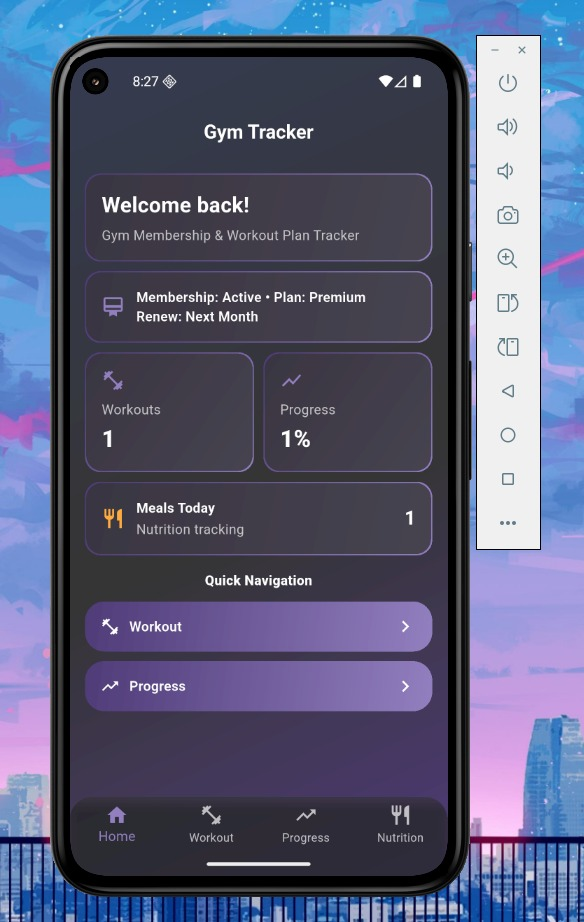
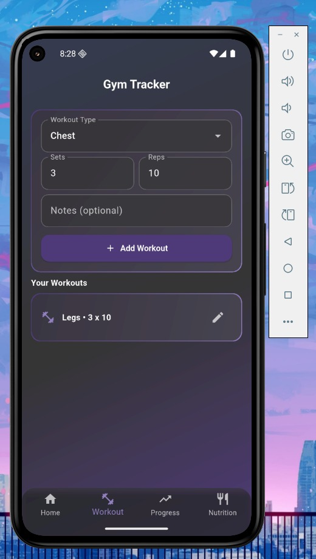
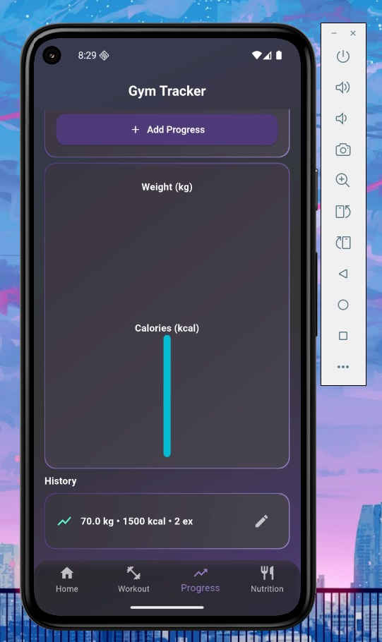
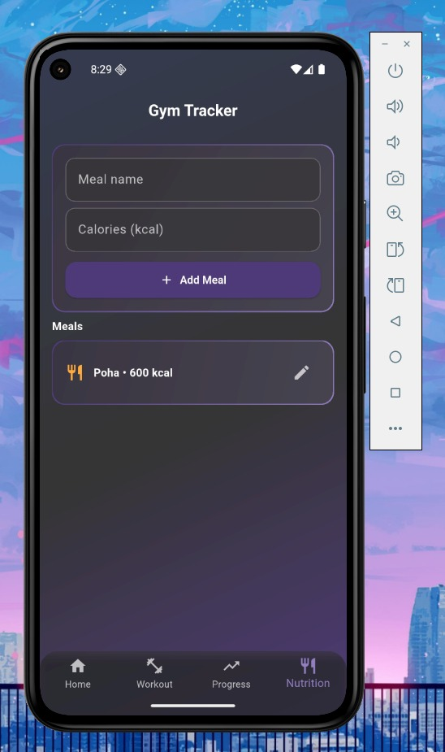
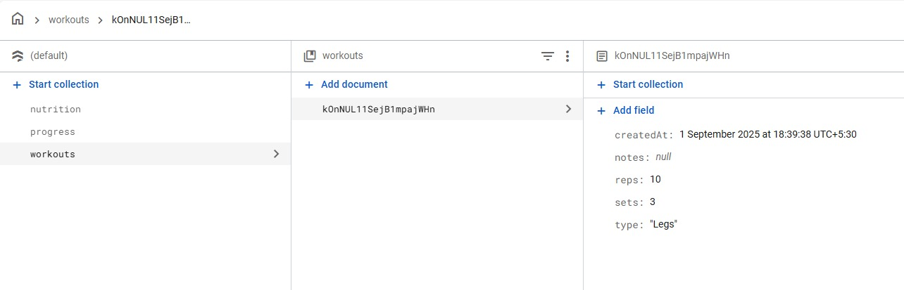

# 🏋️‍♂️ Gym Membership & Workout Plan Tracker

A **Flutter + Firebase** based mobile application that simplifies gym management and enhances user fitness tracking.  
It allows **gym members** to register, track workouts, log nutrition, and monitor progress, while **administrators** can manage memberships and records in real time.  

This project was developed by **Uday Pali (Roll No: 8155, TYBCA)** as part of the **Semester V project (2025-26)** under the guidance of **Prof. Simran Shinde** at **Pillai College of Arts, Commerce & Science (Autonomous), New Panvel**.

---

## 📖 Project Overview
Traditional gyms often rely on manual record-keeping, which is inefficient and prone to errors.  
This app provides a **digital solution** by combining:
- 🔐 Membership management  
- 💪 Workout tracking  
- 🍽 Nutrition logging  
- 📊 Progress monitoring  

It is built with:
- **Flutter** → for cross-platform compatibility (Android & iOS)  
- **Firebase** → for authentication, real-time data storage, and cloud sync  

---

## 🛠️ Modules Implemented

1. **Authentication & Root Module**  
   - Entry point with `main.dart` and `root_shell.dart`  
   - Manages sessions, navigation, and Firebase Auth  

2. **Home Module (`home_page.dart`)**  
   - Dashboard after login  
   - Navigation to Workout, Nutrition, and Progress sections  
   - Displays summary insights  

3. **Workout Module (`workout_page.dart` + `models/workout.dart`)**  
   - Create, edit, and delete structured workout plans  
   - Track sets, reps, type, and notes  
   - Syncs with Firestore in real time  

4. **Nutrition Module (`nutrition_page.dart` + `models/meal.dart`)**  
   - Log meals and calories  
   - Edit and delete meals  
   - Persistent storage in Firestore  

5. **Progress Tracking Module (`progress_page.dart` + `models/progress_record.dart`)**  
   - Record weight, calories, and exercise count  
   - Display history with charts (using `fl_chart`)  
   - Real-time updates from Firestore  

6. **Database Service (`services/firestore_service.dart`)**  
   - Handles CRUD operations with Firestore  
   - Real-time sync for workouts, meals, and progress  

7. **UI/Theme Module (`theme/`, `widgets/`)**  
   - Dracula-inspired dark theme (`app_theme.dart`, `colors.dart`)  
   - Custom widgets like `dracula_card`, `gradient_button`  

---

## 📂 Project Structure
lib/
├── main.dart
├── root_shell.dart
├── pages/
│ ├── home_page.dart
│ ├── workout_page.dart
│ ├── nutrition_page.dart
│ ├── progress_page.dart
├── models/
│ ├── workout.dart
│ ├── meal.dart
│ ├── progress_record.dart
├── services/
│ ├── firestore_service.dart
├── theme/
│ ├── app_theme.dart
│ ├── colors.dart
├── widgets/
│ ├── dracula_card.dart
│ ├── gradient_button.dart
│ ├── gradient_background.dart
│ ├── dracula_scaffold.dart

---

## ⚡ Future Enhancements
- 💳 Online payment integration (Razorpay, Stripe, GPay)  
- 🤝 Trainer–Member chat & personalized plans  
- ⌚ Wearable device sync (Fitbit, Mi Band, Apple Watch)  
- 🤖 AI-powered workout recommendations  
- 🏆 Gamification (badges, leaderboards, rewards)  
- 🎥 Video tutorials & live classes  
- 🏢 Multi-gym/branch support with QR check-in  

---

## 🔍 SWOT Analysis
**Strengths**  
✔ Cross-platform compatibility  
✔ Real-time Firebase sync  
✔ Cloud storage with modular design  
✔ User-friendly modern UI  

**Weaknesses**  
❌ Requires internet (limited offline functionality)  
❌ No payment integration yet  
❌ Heavy reliance on Firebase services  

**Opportunities**  
✨ Wearable integration  
✨ AI-driven features  
✨ Gamification & SaaS expansion  

**Threats**  
⚠ High competition from established apps (FitBit, MyFitnessPal)  
⚠ Data privacy concerns  
⚠ Dependency on Firebase pricing/policies  

---

## 📚 References
- [Flutter Documentation](https://docs.flutter.dev)  
- [Firebase Documentation](https://firebase.google.com/docs)  
- [Cloud Firestore](https://firebase.google.com/docs/firestore)  

---

## 🏁 Conclusion
The **Gym Membership & Workout Plan Tracker** successfully demonstrates how modern mobile technology can **digitize fitness management**.  
By combining **Flutter’s cross-platform UI** with **Firebase’s secure real-time backend**, it provides a reliable, scalable, and engaging solution for both gym administrators and members.  

This project builds a strong foundation for future enhancements, paving the way for a **commercially viable fitness management platform**.

## Looks and Feel 

### UI / UX

### Database [Firebase]

